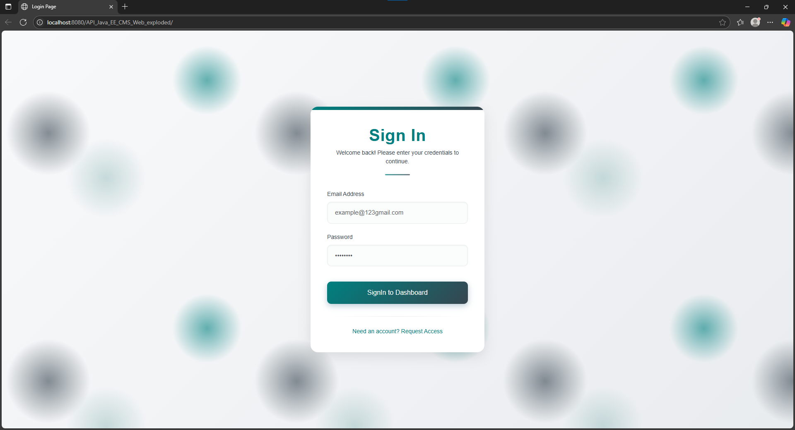
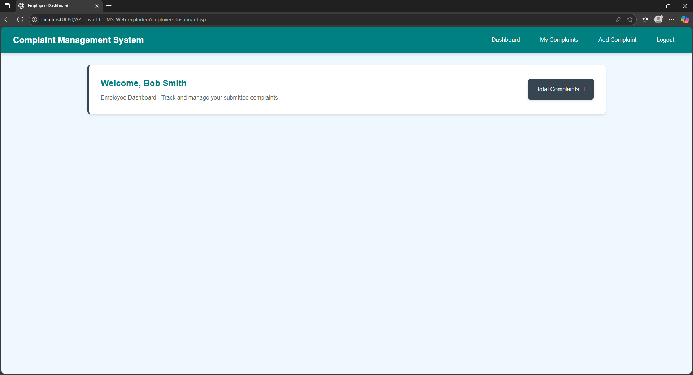
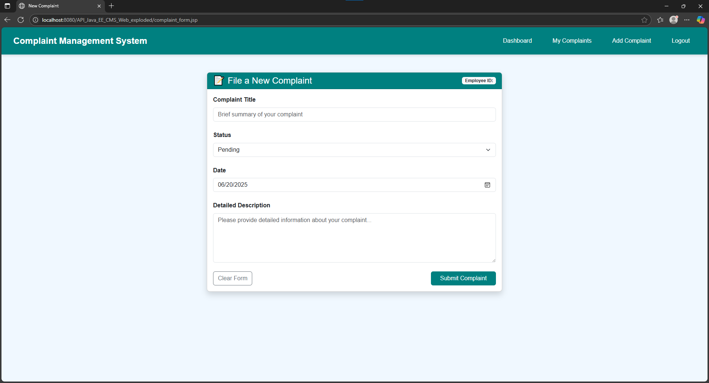
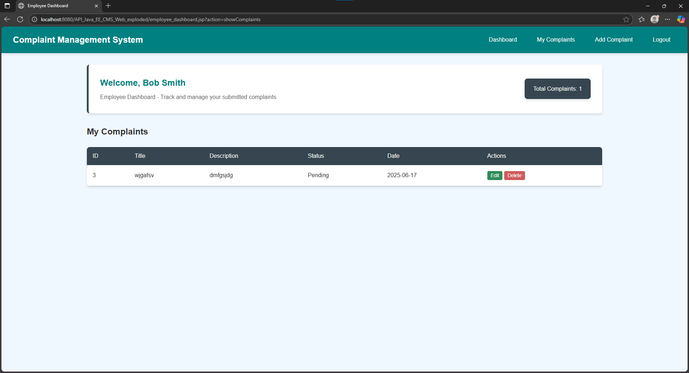
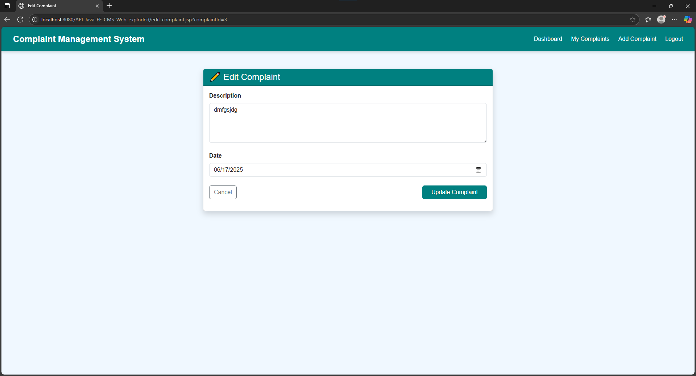
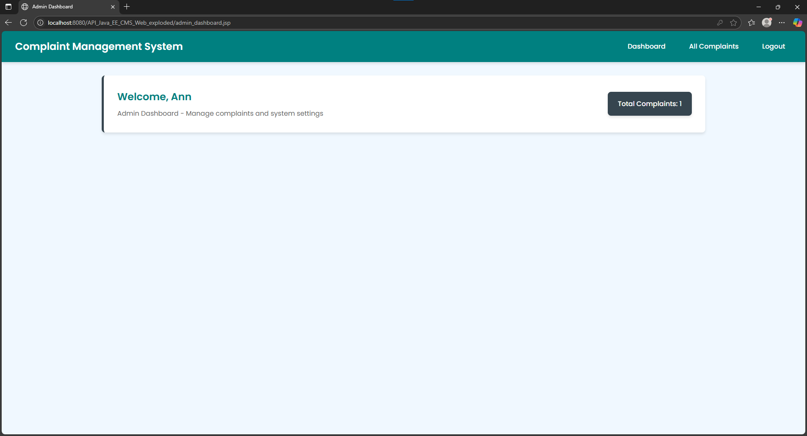
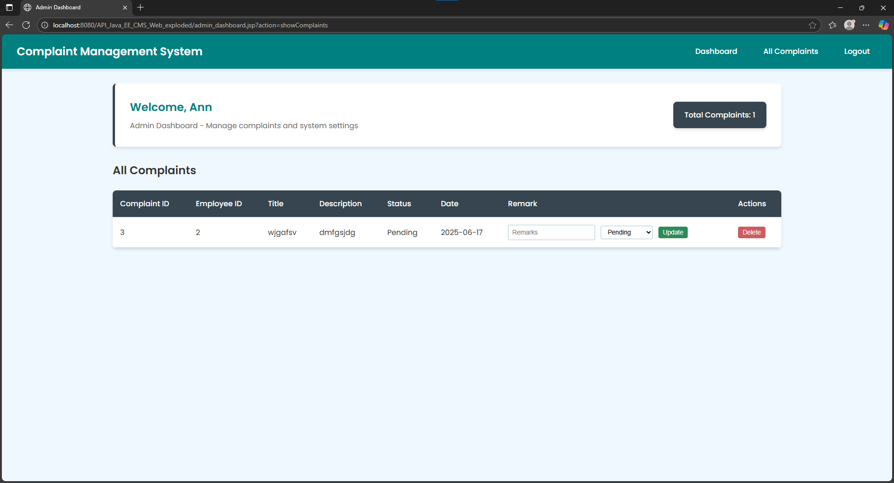

# 📣 Complaint Management System (CMS)

## 🛠️ Project Overview
The Complaint Management System (CMS) is a web-based application designed for internal municipal use. It allows employees to submit and track complaints, and administrators to manage complaint resolutions. This project was built as part of an individual assignment using JavaServer Pages (JSP), Jakarta EE, and MySQL, following the MVC (Model-View-Controller) design pattern.

All HTTP interactions are handled via synchronous HTML form submissions using GET and POST methods. No asynchronous operations (AJAX, fetch, etc.) are used.


## 🚀 Features

### 👨‍💼 Employee Role
- Log in to the system
- Submit new complaints
- View list of submitted complaints
- Edit or delete unresolved complaints

### 👩‍💼 Admin Role
- Log in to the system
- View all complaints from all users
- Update complaint status and add remarks
- Delete any complaint


## 🔧 Technology Stack

| Component    | Technology                              |
|--------------|------------------------------------------|
| Frontend     | JSP, HTML, CSS, JavaScript (validation only) |
| Controller   | Jakarta EE (Servlets)                   |
| Model        | JavaBeans, DAO                          |
| Database     | MySQL via Apache Commons DBCP           |
| Server       | Apache Tomcat                           |


## 🧱 Application Architecture (MVC)
The system follows the Model-View-Controller (MVC) pattern:

- **Model**: JavaBeans and DAO handle data access and business logic
- **View**: JSP pages (e.g., `login.jsp`, `employee_dashboard.jsp`) render the UI and collect form input.
- **Controller**: Java Servlets handle form submission and control the flow between Model and View.

workflow:
  ```
User (JSP Form) -→ Servlet (Controller) -→ DAO (Model) -→ Database
                                   ↑
                          Redirect to JSP

```


## 📁 Project Structure

```
├── src/
│   └── main/
│       └── java/
│           └── org/example/
│               ├── controller/     # All Servlet Controllers
│               ├── dao/            # Database Access Layer
│               ├── model/          # JavaBeans (User, Complaint)
│               └── DBCP/           # DB Connection Pool Setup
│       └── resources/
│           └── db/schema.sql       # MySQL table creation script
├── web/
│   ├── *.jsp                       # JSP pages (views)
│   └── WEB-INF/web.xml            # Web configuration
├── pom.xml                         # (If using Maven)
```

---

## ⚙️ Setup Instructions

### 1. Install Required Software
- Java JDK 11+ 
- Apache Tomcat 10.x
- MySQL Server 8.x
- IntelliJ IDEA / Eclipse
- Git (for version control)

### 2. Clone the Repository

```bash
git clone https://github.com/<your-username>/API-Java-EE-CMS.git
cd API-Java-EE-CMS
```

### 3. Set Up MySQL Database

```sql
CREATE DATABASE cms_db;
```

Then import `schema.sql` located at:
```
/src/main/resources/db/schema.sql
```

### 4. Configure DBCP (in `DataSource.java`)

```java
BasicDataSource ds = new BasicDataSource();
ds.setUrl("jdbc:mysql://localhost:3306/cms_db");
ds.setUsername("your_username");
ds.setPassword("your_password");
ds.setDriverClassName("com.mysql.cj.jdbc.Driver");
```

### 5. Run on Tomcat

- Configure Tomcat in your IDE
- Build and deploy WAR
- Access via browser:

```
http://localhost:8080/cms/
```

---

## 🧪 Test Users

```sql
INSERT INTO users (username, email, password, role) VALUES
('Ann', 'admin@example.com', 'admin123', 'Admin'),
('Smith', 'employee@example.com', 'emp123', 'Employee');
```

---

## 🐞 Troubleshooting

| Issue | Solution |
|-------|----------|
| DB connection error | Check credentials and JDBC URL |
| Page not loading | Ensure WAR deployed correctly |
| Missing driver | Add MySQL JDBC Connector |

---

## 📌 Version Control Guidelines

```bash
git add .
git commit -m "Meaningful message"
git push origin main
```

---


## 📸 Login Page



## 📸 Employee Dashboard



## 📸 New Complaint Page



## 📸 My Complaint Page



## 📸 Edit Complaint Page



## 📸 Admin Dashboard Page



## 📸 All Complaint Page

